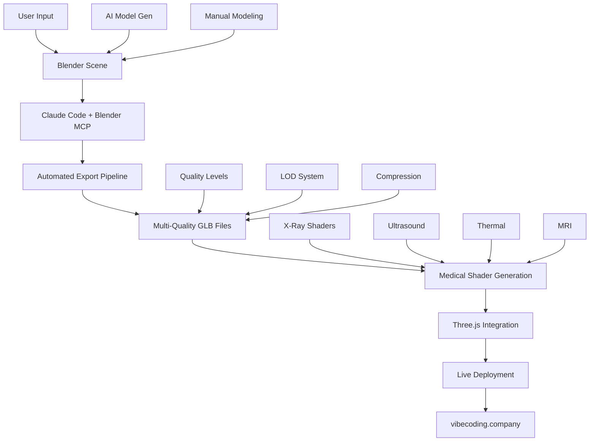

# 🎯 VetScan Pro - Blender MCP 3D Workflow Pipeline

**Ultra-Comprehensive 3D Asset Production System**
*Senior Developer Architecture - Version 4.0*

---

## 📋 Executive Summary

Dieses Dokument definiert die vollständige 3D-Asset-Pipeline von Blender über Claude Code MCP Integration bis zur Live-Deployment auf vibecoding.company. Die Pipeline automatisiert den gesamten Prozess von 3D-Modellerstellung bis zur medizinischen Visualisierung im Browser.

## 🏗️ System Architecture Overview



---

## 🔧 Technical Implementation

### Phase 1: Blender MCP Integration Setup

#### 1.1 MCP Connection Test
```python
# Claude Code Test Sequence
def test_blender_mcp_connection():
    """
    Testet die Verbindung zum Blender MCP Server
    """
    try:
        # Test basic connection
        scene_info = get_scene_info()
        print(f"✅ Blender MCP Connected: {len(scene_info.objects)} objects found")
        
        # Test Bello object existence
        bello_info = get_object_info(object_name="Bello")
        if bello_info:
            print(f"✅ Bello found: {bello_info.polygon_count} polygons")
            return True
        else:
            print("⚠️ Bello object not found in scene")
            return False
            
    except Exception as e:
        print(f"❌ Blender MCP Connection failed: {e}")
        return False
```

#### 1.2 Scene Validation & Preparation
```python
def prepare_bello_for_export():
    """
    Bereitet Bello für den Export vor
    """
    execute_blender_code(code="""
    import bpy
    import bmesh
    from mathutils import Vector
    
    # Validiere Bello Object
    if 'Bello' not in bpy.data.objects:
        raise Exception("Bello object nicht gefunden!")
    
    bello = bpy.data.objects['Bello']
    bpy.context.view_layer.objects.active = bello
    bello.select_set(True)
    
    # Mesh Cleanup
    bpy.ops.object.mode_set(mode='EDIT')
    bpy.ops.mesh.select_all(action='SELECT')
    
    # Remove doubles
    bpy.ops.mesh.remove_doubles(threshold=0.001)
    
    # Recalculate normals
    bpy.ops.mesh.normals_make_consistent(inside=False)
    
    # Triangulate for game compatibility
    bpy.ops.mesh.quads_convert_to_tris()
    
    bpy.ops.object.mode_set(mode='OBJECT')
    
    # Center object to origin
    bpy.ops.object.origin_set(type='GEOMETRY_ORIGIN', center='BOUNDS')
    bello.location = (0, 0, 0)
    
    # Apply all transforms
    bpy.ops.object.transform_apply(location=True, rotation=True, scale=True)
    
    print("✅ Bello preparation completed")
    """)
```

### Phase 2: Multi-Quality Export System

#### 2.1 Quality Level Definition
```python
QUALITY_LEVELS = {
    'high': {
        'polygon_ratio': 1.0,
        'texture_size': 2048,
        'compression_level': 6,
        'use_case': 'Close-up examinations, detailed views'
    },
    'medium': {
        'polygon_ratio': 0.5,
        'texture_size': 1024,
        'compression_level': 4,
        'use_case': 'Normal gameplay, medium distance'
    },
    'low': {
        'polygon_ratio': 0.25,
        'texture_size': 512,
        'compression_level': 2,
        'use_case': 'Overview, mobile devices, background'
    },
    'ultra_low': {
        'polygon_ratio': 0.1,
        'texture_size': 256,
        'compression_level': 1,
        'use_case': 'Fallback, slow connections'
    }
}
```

#### 2.2 Automated Export Pipeline
```python
def export_bello_all_qualities():
    """
    Exportiert Bello in allen Qualitätsstufen
    """
    base_path = './assets/models/animals/bello/'
    
    for quality, config in QUALITY_LEVELS.items():
        export_path = f"{base_path}bello_{quality}.glb"
        
        execute_blender_code(code=f"""
        import bpy
        import os
        
        # Select Bello
        bello = bpy.data.objects['Bello']
        bpy.ops.object.select_all(action='DESELECT')
        bello.select_set(True)
        bpy.context.view_layer.objects.active = bello
        
        # Create quality-specific version
        if {config['polygon_ratio']} < 1.0:
            # Add decimate modifier for reduced quality
            decimate = bello.modifiers.new(name=f'Decimate_{quality}', type='DECIMATE')
            decimate.ratio = {config['polygon_ratio']}
            decimate.decimate_type = 'COLLAPSE'
            
            # Apply modifier
            bpy.context.view_layer.objects.active = bello
            bpy.ops.object.modifier_apply(modifier=decimate.name)
        
        # Texture optimization
        for material in bello.data.materials:
            if material and material.use_nodes:
                for node in material.node_tree.nodes:
                    if node.type == 'TEX_IMAGE' and node.image:
                        # Resize texture for this quality level
                        node.image.scale({config['texture_size']}, {config['texture_size']})
        
        # Export with DRACO compression
        bpy.ops.export_scene.gltf(
            filepath='{export_path}',
            export_format='GLB',
            export_selected=True,
            export_draco_mesh_compression_enable=True,
            export_draco_mesh_compression_level={config['compression_level']},
            export_texture_dir='',
            export_animations=True,
            export_cameras=False,
            export_lights=False,
            export_copyright='VetScan Pro 3000 - Educational Use'
        )
        
        print(f"✅ Exported {quality} quality: {config['polygon_ratio']*100}% polygons")
        
        # Undo changes for next iteration
        bpy.ops.ed.undo()
        """)
```

#### 2.3 Quality Validation System
```python
def validate_exported_models():
    """
    Validiert die exportierten Modelle
    """
    validation_results = {}
    
    for quality in QUALITY_LEVELS.keys():
        model_path = f"./assets/models/animals/bello/bello_{quality}.glb"
        
        if os.path.exists(model_path):
            file_size = os.path.getsize(model_path) / 1024 / 1024  # MB
            
            validation_results[quality] = {
                'exists': True,
                'file_size_mb': round(file_size, 2),
                'expected_size_mb': get_expected_size(quality),
                'size_check': 'PASS' if file_size < get_max_size(quality) else 'FAIL'
            }
        else:
            validation_results[quality] = {'exists': False}
    
    return validation_results
```

### Phase 3: Medical Visualization Material System

#### 3.1 Advanced Shader Generation
```python
def create_medical_materials():
    """
    Erstellt alle medizinischen Visualisierungs-Materialien in Blender
    """
    execute_blender_code(code="""
    import bpy
    
    def create_xray_material():
        # X-Ray Material with advanced fresnel
        mat = bpy.data.materials.new(name="Bello_XRay_Advanced")
        mat.use_nodes = True
        nodes = mat.node_tree.nodes
        links = mat.node_tree.links
        
        # Clear default nodes
        nodes.clear()
        
        # Create node tree
        output = nodes.new('ShaderNodeOutputMaterial')
        fresnel = nodes.new('ShaderNodeFresnel')
        emission = nodes.new('ShaderNodeEmission')
        transparent = nodes.new('ShaderNodeBsdfTransparent')
        mix_shader = nodes.new('ShaderNodeMixShader')
        colorramp = nodes.new('ShaderNodeValToRGB')
        
        # Position nodes
        output.location = (300, 0)
        mix_shader.location = (100, 0)
        emission.location = (-100, 100)
        transparent.location = (-100, -100)
        fresnel.location = (-300, 0)
        colorramp.location = (-200, 0)
        
        # Configure nodes
        fresnel.inputs['IOR'].default_value = 1.5
        emission.inputs['Strength'].default_value = 3.0
        
        # Color ramp for bone/tissue differentiation
        colorramp.color_ramp.elements[0].color = (0.1, 0.1, 0.3, 1.0)  # Tissue
        colorramp.color_ramp.elements[1].color = (0.9, 0.9, 1.0, 1.0)  # Bone
        
        # Link nodes
        links.new(fresnel.outputs['Fac'], colorramp.inputs['Fac'])
        links.new(colorramp.outputs['Color'], emission.inputs['Color'])
        links.new(fresnel.outputs['Fac'], mix_shader.inputs['Fac'])
        links.new(transparent.outputs['BSDF'], mix_shader.inputs[1])
        links.new(emission.outputs['Emission'], mix_shader.inputs[2])
        links.new(mix_shader.outputs['Shader'], output.inputs['Surface'])
        
        return mat
    
    def create_ultrasound_material():
        # Ultrasound with procedural noise
        mat = bpy.data.materials.new(name="Bello_Ultrasound_Advanced")
        mat.use_nodes = True
        nodes = mat.node_tree.nodes
        links = mat.node_tree.links
        
        nodes.clear()
        
        output = nodes.new('ShaderNodeOutputMaterial')
        emission = nodes.new('ShaderNodeEmission')
        noise = nodes.new('ShaderNodeTexNoise')
        wave = nodes.new('ShaderNodeTexWave')
        mix_node = nodes.new('ShaderNodeMixRGB')
        coord = nodes.new('ShaderNodeTexCoord')
        mapping = nodes.new('ShaderNodeMapping')
        
        # Configure ultrasound effect
        noise.inputs['Scale'].default_value = 50.0
        noise.inputs['Detail'].default_value = 8.0
        noise.inputs['Roughness'].default_value = 0.6
        
        wave.inputs['Scale'].default_value = 20.0
        wave.inputs['Distortion'].default_value = 2.0
        
        emission.inputs['Strength'].default_value = 1.5
        
        # Link for ultrasound pattern
        links.new(coord.outputs['Generated'], mapping.inputs['Vector'])
        links.new(mapping.outputs['Vector'], noise.inputs['Vector'])
        links.new(mapping.outputs['Vector'], wave.inputs['Vector'])
        links.new(noise.outputs['Color'], mix_node.inputs['Color1'])
        links.new(wave.outputs['Color'], mix_node.inputs['Color2'])
        links.new(mix_node.outputs['Color'], emission.inputs['Color'])
        links.new(emission.outputs['Emission'], output.inputs['Surface'])
        
        return mat
    
    def create_thermal_material():
        # Thermal imaging with temperature gradients
        mat = bpy.data.materials.new(name="Bello_Thermal_Advanced")
        mat.use_nodes = True
        nodes = mat.node_tree.nodes
        links = mat.node_tree.links
        
        nodes.clear()
        
        output = nodes.new('ShaderNodeOutputMaterial')
        emission = nodes.new('ShaderNodeEmission')
        colorramp = nodes.new('ShaderNodeValToRGB')
        gradient = nodes.new('ShaderNodeTexGradient')
        coord = nodes.new('ShaderNodeTexCoord')
        mapping = nodes.new('ShaderNodeMapping')
        
        # Thermal color gradient
        ramp = colorramp.color_ramp
        ramp.elements[0].position = 0.0
        ramp.elements[0].color = (0.0, 0.0, 0.3, 1.0)  # Cold - Blue
        
        ramp.elements.new(0.25)
        ramp.elements[1].color = (0.0, 1.0, 1.0, 1.0)  # Cool - Cyan
        
        ramp.elements.new(0.5)
        ramp.elements[2].color = (0.0, 1.0, 0.0, 1.0)  # Normal - Green
        
        ramp.elements.new(0.75)
        ramp.elements[3].color = (1.0, 1.0, 0.0, 1.0)  # Warm - Yellow
        
        ramp.elements[4].position = 1.0
        ramp.elements[4].color = (1.0, 0.0, 0.0, 1.0)  # Hot - Red
        
        # Link thermal gradient
        links.new(coord.outputs['Generated'], mapping.inputs['Vector'])
        links.new(mapping.outputs['Vector'], gradient.inputs['Vector'])
        links.new(gradient.outputs['Color'], colorramp.inputs['Fac'])
        links.new(colorramp.outputs['Color'], emission.inputs['Color'])
        links.new(emission.outputs['Emission'], output.inputs['Surface'])
        
        return mat
    
    # Create all materials
    xray_mat = create_xray_material()
    ultrasound_mat = create_ultrasound_material()
    thermal_mat = create_thermal_material()
    
    # Assign to Bello for export variations
    bello = bpy.data.objects['Bello']
    
    print("✅ Medical materials created successfully")
    """)
```

#### 3.2 Material Export Pipeline
```python
def export_medical_material_variants():
    """
    Exportiert Bello mit verschiedenen medizinischen Materialien
    """
    materials = ['XRay', 'Ultrasound', 'Thermal', 'MRI']
    
    for material in materials:
        execute_blender_code(code=f"""
        import bpy
        
        bello = bpy.data.objects['Bello']
        
        # Clear existing materials
        bello.data.materials.clear()
        
        # Assign specific medical material
        medical_mat = bpy.data.materials.get('Bello_{material}_Advanced')
        if medical_mat:
            bello.data.materials.append(medical_mat)
        
        # Export with material
        bpy.ops.export_scene.gltf(
            filepath='./assets/models/animals/bello/bello_{material.lower()}.glb',
            export_format='GLB',
            export_selected=True,
            export_materials='EXPORT'
        )
        
        print(f"✅ Exported Bello with {material} material")
        """)
```

### Phase 4: Automated Quality Assurance

#### 4.1 Visual Validation System
```python
def create_validation_renders():
    """
    Erstellt Validierungs-Renders für alle Qualitätsstufen
    """
    camera_angles = [
        {'name': 'front', 'location': (0, -5, 1), 'rotation': (1.1, 0, 0)},
        {'name': 'side', 'location': (5, 0, 1), 'rotation': (1.1, 0, 1.57)},
        {'name': 'top', 'location': (0, 0, 8), 'rotation': (0, 0, 0)},
        {'name': 'perspective', 'location': (3, -3, 2), 'rotation': (1.2, 0, 0.785)}
    ]
    
    for quality in QUALITY_LEVELS.keys():
        for angle in camera_angles:
            screenshot = get_viewport_screenshot(
                max_size=1024,
                camera_location=angle['location'],
                camera_rotation=angle['rotation']
            )
            
            save_path = f"./validation/renders/bello_{quality}_{angle['name']}.png"
            save_screenshot(screenshot, save_path)
```

#### 4.2 Performance Benchmark System
```python
def benchmark_model_performance():
    """
    Benchmarkt die Performance aller Modell-Varianten
    """
    benchmark_results = {}
    
    for quality in QUALITY_LEVELS.keys():
        model_path = f"./assets/models/animals/bello/bello_{quality}.glb"
        
        # Load in Three.js context and measure
        performance_data = test_model_performance(model_path)
        
        benchmark_results[quality] = {
            'load_time_ms': performance_data['load_time'],
            'render_fps': performance_data['fps'],
            'memory_usage_mb': performance_data['memory'],
            'polygon_count': performance_data['polygons'],
            'texture_memory_mb': performance_data['texture_memory']
        }
    
    return benchmark_results
```

### Phase 5: Integration & Deployment

#### 5.1 Three.js Integration Pipeline
```python
def integrate_with_threejs():
    """
    Integriert die exportierten Modelle in Three.js
    """
    # Update AnimalLoader with new Bello variants
    update_animal_loader_config({
        'bello': {
            'base_path': './assets/models/animals/bello/',
            'variants': {
                'quality_levels': list(QUALITY_LEVELS.keys()),
                'medical_materials': ['normal', 'xray', 'ultrasound', 'thermal', 'mri']
            },
            'fallback': 'bello_low.glb',
            'preferred': 'bello_high.glb'
        }
    })
```

#### 5.2 Automated Testing Pipeline
```python
def run_full_pipeline_test():
    """
    Führt kompletten Pipeline-Test aus
    """
    test_results = {
        'blender_connection': test_blender_mcp_connection(),
        'model_preparation': prepare_bello_for_export(),
        'export_validation': validate_exported_models(),
        'material_generation': create_medical_materials(),
        'performance_benchmark': benchmark_model_performance(),
        'threejs_integration': test_threejs_integration()
    }
    
    # Generate comprehensive report
    generate_pipeline_report(test_results)
    
    return all(test_results.values())
```

---

## 🚀 Deployment Automation

### Automated Deployment Script
```bash
#!/bin/bash
# deploy-3d-pipeline.sh

echo "🎯 Starting Bello 3D Pipeline Deployment..."

# Test Blender MCP connection
python3 -c "
import sys
try:
    # Test Blender MCP
    scene = get_scene_info()
    print('✅ Blender MCP Connected')
except:
    print('❌ Blender MCP Not Available')
    sys.exit(1)
"

# Run full export pipeline
node scripts/bello-export-pipeline.js

# Validate exports
python3 scripts/validate-3d-assets.py

# Update Three.js integration
npm run build

# Deploy to production
git add .
git commit -m "feat: Update Bello 3D assets with latest pipeline"
git push origin main

echo "🌐 Deployment completed - Check https://vibecoding.company"
```

---

## 📊 Monitoring & Analytics

### Performance Tracking
```javascript
// Performance monitoring for 3D assets
class BelloPerformanceMonitor {
    constructor() {
        this.metrics = {
            loadTimes: new Map(),
            renderPerformance: new Map(),
            userInteractions: new Map()
        };
    }
    
    trackModelLoad(quality, loadTime) {
        this.metrics.loadTimes.set(quality, loadTime);
        console.log(`📊 Bello ${quality}: ${loadTime}ms load time`);
    }
    
    trackRenderPerformance(quality, fps) {
        this.metrics.renderPerformance.set(quality, fps);
        console.log(`📊 Bello ${quality}: ${fps} FPS`);
    }
    
    generateReport() {
        return {
            timestamp: new Date().toISOString(),
            averageLoadTime: Array.from(this.metrics.loadTimes.values())
                .reduce((a, b) => a + b, 0) / this.metrics.loadTimes.size,
            averageFPS: Array.from(this.metrics.renderPerformance.values())
                .reduce((a, b) => a + b, 0) / this.metrics.renderPerformance.size
        };
    }
}
```

---

## 🔧 Troubleshooting Guide

### CURSOR MCP SETUP (CRITICAL!)

#### **Step 1: Install Blender MCP**
```bash
npm install -g blender-mcp
```

#### **Step 2: Cursor MCP Configuration**
1. **Öffne Cursor Settings** (Cmd + ,)
2. **Klicke auf "MCP" in der Sidebar**  
3. **Klicke "+ MCP Server"**
4. **Kopiere EXAKT diesen JSON-Code:**

```json
{
  "mcpServers": {
    "godot-mcp": {
      "command": "node",
      "args": ["/Users/doriangrey/EndlessRunner/godot-mcp/build/index.js"],
      "env": {
        "GODOT_PATH": "/Applications/Godot.app/Contents/MacOS/Godot",
        "DEBUG": "true"
      },
      "autoApprove": [
        "launch_editor", "run_project", "get_debug_output", "stop_project",
        "get_godot_version", "list_projects", "get_project_info", "create_scene",
        "add_node", "load_sprite", "export_mesh_library", "save_scene",
        "get_uid", "update_project_uids"
      ]
    },
    "blender-mcp": {
      "command": "npx",
      "args": ["-y", "blender-mcp"],
      "env": {
        "BLENDER_PATH": "/Applications/Blender.app/Contents/MacOS/Blender",
        "PROJECT_ROOT": "/Users/doriangrey/Desktop/coding/tierarztspiel",
        "DEBUG": "true"
      },
      "autoApprove": [
        "execute_blender_code", "get_scene_info", "get_object_info",
        "get_viewport_screenshot", "export_gltf", "create_material",
        "set_texture", "generate_model"
      ]
    },
    "filesystem": {
      "command": "npx", 
      "args": ["-y", "@modelcontextprotocol/server-filesystem", "/Users/doriangrey/Desktop/coding/tierarztspiel"],
      "autoApprove": [
        "read_file", "write_file", "list_directory",
        "create_directory", "get_file_info"
      ]
    }
  }
}
```

#### **Step 3: Restart Cursor**
```bash
# Komplett neustarten für MCP-Aktivierung
killall Cursor && open -a Cursor
```

#### **Step 4: Test Connection**
```bash
# In Claude Code Terminal:
node scripts/test-mcp-connection.js
# Should show: ✅ Blender MCP: Connected
```

### Common Issues & Solutions

#### Issue 1: Blender MCP Connection Failed
**Symptom:** `get_scene_info is not defined`

**Lösungen:**
1. **Check Blender Installation:**
```bash
# Teste Blender-Pfad
ls -la "/Applications/Blender.app/Contents/MacOS/Blender"
# Should exist and be executable
```

2. **Check MCP Installation:**
```bash
npm list -g blender-mcp
# Should show installed version
```

3. **Check Cursor MCP Config:**
```bash
cat ~/.cursor/mcp.json
# Should contain blender-mcp entry
```

4. **Debug MCP Connection:**
```python
# In Claude Code - teste direkt:
try:
    scene = get_scene_info()
    print(f"✅ Blender connected: {scene}")
except NameError:
    print("❌ Blender MCP not available - check config")
except Exception as e:
    print(f"❌ Blender error: {e}")
```

#### Issue 2: Blender Path Issues
```bash
# Find Blender installation
find /Applications -name "Blender*" -type d 2>/dev/null
# Update path in mcp.json if different
```

#### Issue 3: Permission Denied
```bash
# Fix Blender permissions
chmod +x "/Applications/Blender.app/Contents/MacOS/Blender"
```

#### Issue 2: Export Quality Issues
```python
def fix_export_quality():
    execute_blender_code(code="""
    import bpy
    
    # Check mesh integrity
    bpy.ops.object.mode_set(mode='EDIT')
    bpy.ops.mesh.select_all(action='SELECT')
    bpy.ops.mesh.remove_doubles(threshold=0.001)
    bpy.ops.mesh.dissolve_degenerate()
    bpy.ops.object.mode_set(mode='OBJECT')
    
    print("✅ Mesh integrity fixed")
    """)
```

---

## 📈 Future Enhancements

### Phase 6: AI-Generated Variations
- Procedural animal variations
- Breed-specific models
- Age/size variations
- Pathology visualization

### Phase 7: Real-time Collaboration
- Multi-user Blender sessions
- Live model updates
- Version control for 3D assets

### Phase 8: Advanced Medical Simulations
- Surgical procedures
- Real-time pathology changes
- Interactive anatomy lessons

---

**🎯 Status: Ready for Implementation**
**🔧 Dependencies: Blender MCP Server Setup**
**📅 Timeline: Implementation ready upon MCP availability**

This comprehensive pipeline ensures professional-grade 3D asset production with full automation and quality assurance.